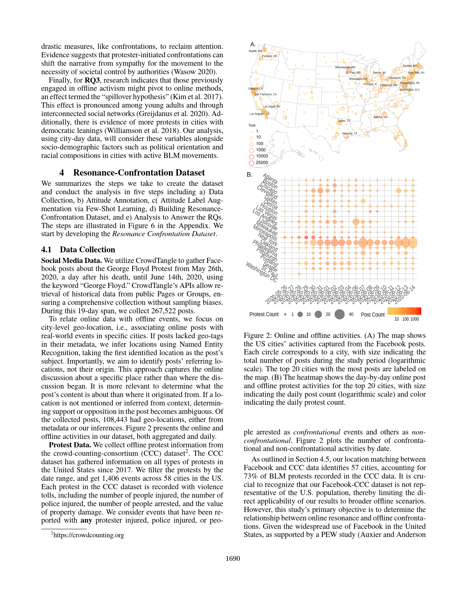
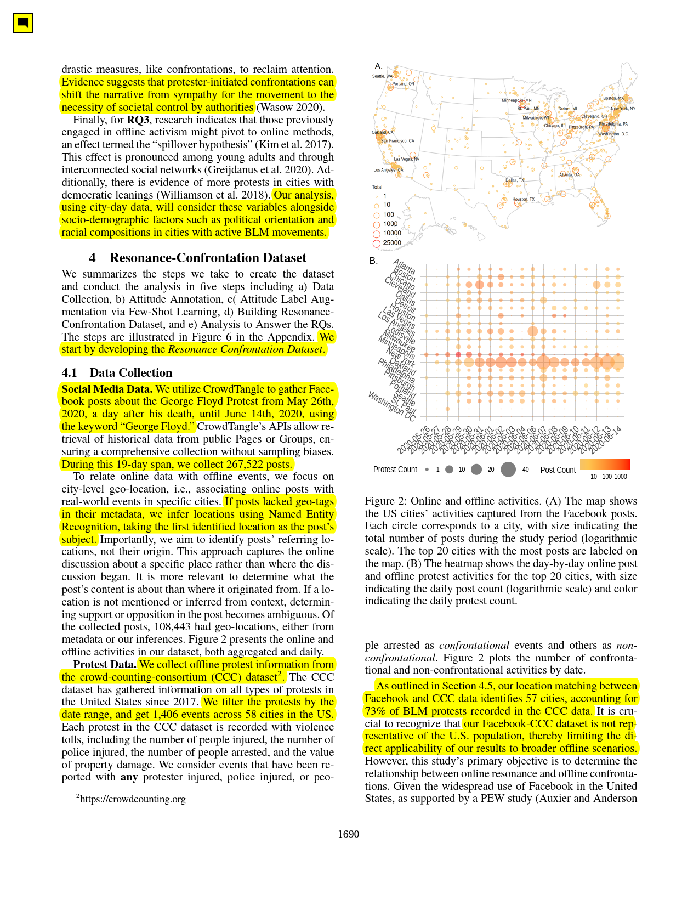

# highlight-this-paper

Having just started my PhD, I've been thinking about the ways I could make my life a bit easier when going through papers. I figured it would be great if I could use an LLM to highlight and summarise the most salient parts for me.

<p align="center">
  
</p> 


Using the GPT4o-mini model and the new Structured JSON output types, I did exactly that. It highlights and adds a summary as a comment on the top left corner of every page. Here's an example.

| Before | After |
|--------|-------|
|  |  |

It's certainly far from perfect: there's a few assumptions that I have made + the code is quite messy to say the least, but it seems to work decently well from the ones I have tested. More examples in the `examples` folder.

(Working with PDFs is a nightmare, and I'll probably never do it again.)

## Setup

0. Create an OpenAI account, generate an API key, and create an assistant with the prompt and schema found within the `assistant` folder.

1. Install the required dependencies:
```
pip install auto-py-to-exe openai pymupdf watchdog python-dotenv
```

2. Convert `service.py` to an executable:
   - Run `auto-py-to-exe` in your terminal
   - Select 'One File' and 'Window Based' options
   - Choose `service.py` as the script location
   - Click "Convert .py to .exe"

3. Create a `.env` file in the same directory as the executable with the following content:
   ```
   OPENAI_API_KEY=your_openai_api_key
   OPENAI_ASST_ID=your_openai_assistant_id
   MAIN_PATH=C:\path\to\your\main\folder
   ```

4. Inside your main folder, create two subfolders: `raw` and `highlighted`

5. Usage:
   - Run the `service.exe` file
   - Place PDF papers you want to process in the `raw` folder
   - Processed and highlighted papers will appear in the `highlighted` folder
   - Files will be renamed as `{year}_{author}_{keyword}.pdf`
